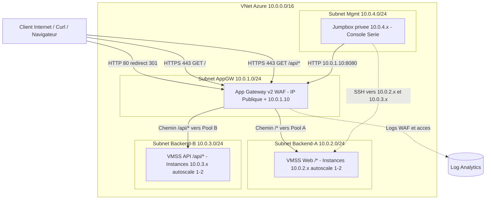

# Architecture Web Multi-Tiers Sécurisée avec VMSS et Application Gateway WAF v2 (Zero-Trust Egress)

## 📌 Contexte & Objectifs

Ce dépôt présente une architecture multi-tiers privée. Elle est alignée sur les compétences de la certification **AZ-104 (Administrateur Microsoft Azure)** et intègre les principes du *Zero-Trust* :

* **Sortie Internet nulle (*Zero Internet Egress*) :** les ensembles de machines virtuelles identiques (*VM Scale Sets* / VMSS) et la Jumpbox d'administration ne possèdent aucune adresse IP publique et n'ont aucun accès sortant direct vers Internet.
* **Observabilité & Audit KQL :** streaming des logs WAF (`ApplicationGatewayFirewallLog`) vers un espace Log Analytics pour l'analyse des menaces en temps réel.
* **Entrée privée (*Private Gateway Ingress*) :** accès administratif et routage interne via une adresse IP privée (`10.0.1.10`).
* **Routage par chemin (*Path-Based Routing*) :** répartition intelligente du trafic séparant la racine `/` (service Web) et `/api/*` (service API) vers des pools *backend* dédiés.

---

## 📐 Schéma d'Architecture

---

## 📦 Ressources Déployées

* **Réseau & Sécurité :**
  * **1 Virtual Network (VNet) :** `10.0.0.0/16`
  * **4 Sous-réseaux dédiés :** `subnet-appgw` (`10.0.1.0/24`), `subnet-backend-a` (`10.0.2.0/24`), `subnet-backend-b` (`10.0.3.0/24`), `subnet-mgmt` (`10.0.4.0/24`)
  * **4 Network Security Groups (NSG) :** isolation stricte inter‑subnets ; les VMSS et la Jumpbox n'ont aucun accès direct à Internet (Zero‑Trust Egress).
* **Ingress & WAF :**
  * **1 Application Gateway v2 (WAF), 2 instances :** IP publique Standard + IP privée (`10.0.1.10`), certificat SSL/TLS PFX, moteur WAF OWASP CRS 3.2.
  * **Règles de routage :** redirection HTTP (port 80) vers HTTPS (port 443) et routage basé sur le chemin (`/` et `/api/*`).
* **Calcul & Backend :**
  * **2 VM Scale Sets (VMSS) :** instances Ubuntu sans IP publique, bootstrap `cloud-init` (serveurs Web & API), autoscale 1–2 instances par VMSS.
  * **1 VM Jumpbox :** instance d'administration privée dans `subnet-mgmt` (accès console série / diagnostic).
* **Supervision & Observabilité :**
  * **1 Espace de travail Log Analytics :** collecte centralisée des journaux d'accès AppGW, des événements WAF (OWASP), des métriques VMSS et (optionnellement) des NSG Flow Logs.
