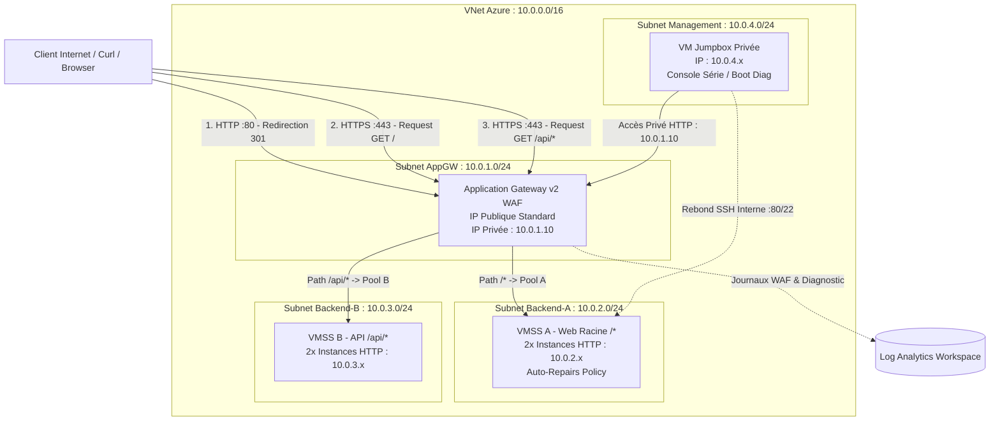

# Azure AZ-104 Lab: Secure Enterprise Multi-Tier Web Architecture with Application Gateway WAF v2 (Zero-Trust Egress)

## 📌 Context & Objectives
This repository demonstrates a fully private, production-grade multi-tier architecture on Microsoft Azure aligned with **AZ-104 (Azure Administrator)** skills and Zero-Trust principles:
- **Zero Internet Egress:** VM Scale Sets (VMSS) and Management Jumpbox have no public IP addresses and zero outbound access to the Internet.
- **WAF Security:** Application Gateway WAF v2 handles TLS termination, public HTTPS routing, and Web Application Firewall rules (OWASP v3.2).
- **Private Gateway Ingress:** Internal administrative and routing access via a private frontend IP (`10.0.1.10`).
- **Path-Based Routing:** Smart routing separating `/` (Web Service) and `/api/*` (API Service) across dedicated backends.

---

## 📐 Architecture Diagram

